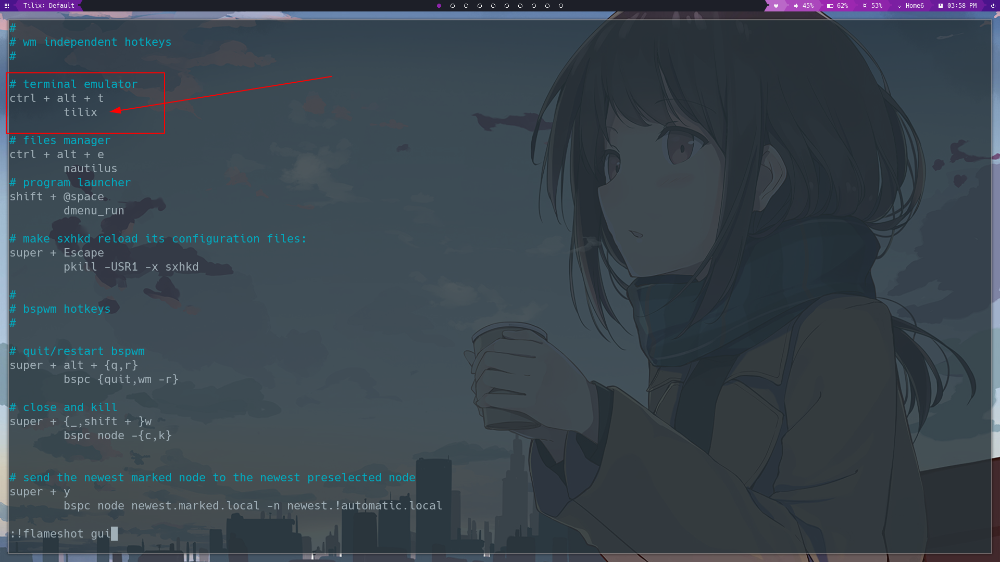
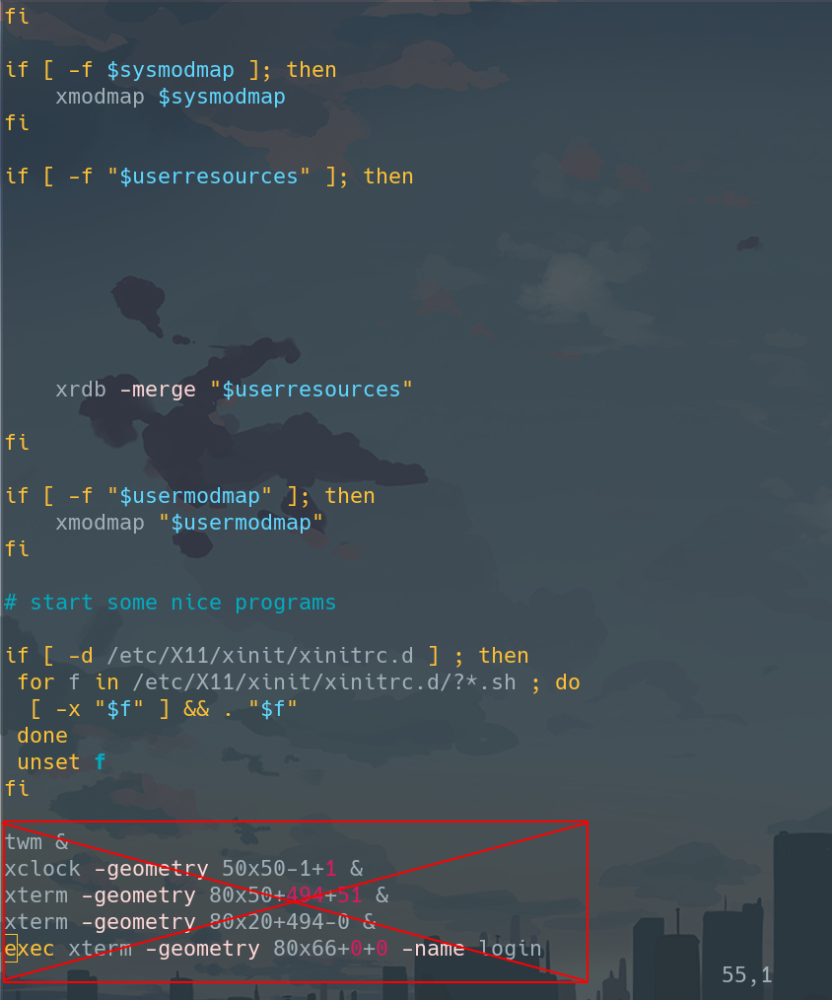

# Arch Installation Guide (2020, BIOS/UEFI) #

This manual is merge of official installation guide - https://wiki.archlinux.org/index.php/Installation_guide</br>
Arch users manuals like - https://gist.github.com/tz4678/bd33f94ab96c96bc6719035fcac2b807</br>
And my own improvements and configurations.</br>
Hope it will help you too with your arch installation and configuration, but i created this instruction only to save my own time)))


<!-- nav -->
# Table of content
- [1. Download and check ISO file](#1-download-and-check-iso-file)
  - [1.1 sha1sum](#11-sha1sum)
  - [1.2 md5sum](#12-md5sum)
  - [1.3 Signature verify](#13-signature-verify)
    - [In Arch Linux](#in-arch-linux)
    - [In other linux distro](#in-other-linux-distro)
- [2. Writing an image on flash](#2-writing-an-image-on-flash)
  - [Using Linux dd (terminal)](#dd)
  - [Via gui app](#via-gui-app)
- [3. Verify the boot mode](#3-verify-the-boot-mode)
- [4. Connect to the Internet](#4-connect-to-the-internet)
  - [4.1 Ethernet](#41-ethernet)
  - [4.2 Wifi](#42-wifi)
- [5. Update the system clock](#5-update-the-system-clock)
- [6. Partition the disks, format partitions, mount file systems](#6-partition-the-disks-format-partitions-mount-file-systems)
   - [6.1 Partition the disks](#61-partition-the-disks)
   - [6.2 Format partitions](#62-format-partitions)
   - [6.3 Mount file systems](#63-mount-file-systems)
- [7. Sort mirror list](#7-sort-mirror-list)
   - [7.1 Backup original mirror list](#71-backup-original-mirror-list)
   - [7.2 Sort](#72-sort)
- [8. Install essential packages and generating fstab](#8-install-essential-packages-and-generating-fstab)
  - [8.1 Pacstrap](#81-pacstrap)
  - [8.2 Fstab generating](#82-fstab-generating)
- [9. Chroot](#9-chroot)
  - [9.1 Set the time zone](#91-set-the-time-zone)
  - [9.2 Localization](#92-localization)
  - [9.3 Network configuration](#93-network-configuration)
  - [9.4 Download some packages](#94-download-some-packages)
  - [9.5 Set the root password](#95-set-the-root-password)
  - [9.6 Creating a user](#96-creating-a-user)
  - [9.7 Grub](#97-grub)
  - [9.8 Umount /mnt and reboot](#98-umount-mnt-and-reboot)
- [10. After installation](#10-after-installation)
<!-- /nav -->

## 1. Download and check ISO file
It is recommended to verify the image signature and hash sum before use, especially when downloading from an HTTP mirror, where downloads are generally prone to be intercepted to serve malicious images.</br></br>
First, we should find sha1 or md5 sums of ISO file on official web-site - https://www.archlinux.org/download/ and copy one of it for verify

### 1.1 sha1sum
```bash
echo "archlinux_sha1sum_from_site archlinux-version-x86_64.iso" | sha1sum --check -
```
For example:</br>
```bash
echo "739fab8d23430a01629a131ae02713a09af86968 archlinux-2020.11.01-x86_64.iso" | sha1sum --check -
```
If you will see smt like this:</br>
>archlinux-2020.11.01-x86_64.iso: OK

Than your iso is OK and you can write it on your flash.

Otherwise, you should know that your image is damaged and needs to be reinstalled. For example:</br>
>archlinux-2020.11.01-x86_64.iso: FAILED</br>
>sha1sum: WARNING: 1 computed checksum did NOT match

### 1.2 md5sum
Everything is the same but with MD5:
```bash
echo "md5sum_of_archlinux_iso archlinus-version-x86_64.iso" | md5sum --check -
```
### 1.3 Signature verify
You can download pgp signature from official web-site - https://www.archlinux.org/download/

#### In Arch Linux
If you already have Arch Linux you can use key in your system to verify signature:
```bash
sudo pacman-key -v archlinux-version-x86_64.iso.sig
```
Output for correct signature:
>==> Checking archlinux-2020.11.01-x86_64.iso.sig... (detached)</br>
>gpg: Signature made Sun 01 Nov 2020 09:42:16 AM MSK</br>
>gpg:                using RSA key 4AA4767BBC9C4B1D18AE28B77F2D434B9741E8AC</br>
>gpg: ___Good___ signature from "Pierre Schmitz <pierre@archlinux.de>" [full]

This is bad output(i am replaced only 1 letter in .sig file):
>==> Checking archlinux-2020.11.01-x86_64.iso.sig... (detached)</br>
>gpg: Signature made Sun 01 Nov 2020 09:42:16 AM MSK</br>
>gpg:                using RSA key 4AA4767BBC9C4B1D18AE28B77F2D434B9741E8AC</br>
>gpg: ___BAD___ signature from "Pierre Schmitz <pierre@archlinux.de>" [full]</br>
>==> ERROR: The signature identified by archlinux-2020.11.01-x86_64.iso.sig could not be verified.

#### In other linux distro
There is little bit harder way.</br>
We should download GnuPG ( this package has different names in different distributions ):

Then we should download public key to verify sing:
```bash
gpg --recv-keys --keyserver=hkp://keys.gnupg.net 7F2D434B9741E8AC
```
And verify the sing:
```bash
gpg --verify archlinux-version-x86_64.iso.sig
```

## 2. Writing an image on flash
Download official iso from https://www.archlinux.org/download/ , and write it on your flash:

### dd
You can find your flash using command:
```bash
sudo fdisk -l
```
And write image on it:
```bash
sudo dd if=/path/to/arch_iso of=/dev/your_flash bs=8M status=progress
```

### Via gui app
Everything is the same but with gui application. I prefer use Balena Etcher, it is simple, minimalistic and beautiful app. Etcher is available for Windows, Linux and MacOS. You can download it from official web-site - https://www.balena.io/etcher/


## 3. Verify the boot mode
After we boot with flash first of all we need to verify the boot mode.
```bash
ls /sys/firmware/efi/efivars
```
If the command shows the directory without error, then the system is booted in UEFI mode. If the directory does not exist, the system may be booted in BIOS (or CSM) mode.

## 4. Connect to the Internet
Lets set up an Internet connection.

### 4.1 Ethernet
If you use Ethernet, everything is already working fine without any configurations. But anywat, you should check your Internet connection.
```bash
ping archlinux.org
```

### 4.2 Wifi
Wifi configuration requires couple of commands.
Make sure the wireless card is not blocked with rfkill:
```bash
rfkill list
```
If it is blocked, do this:
```bash
rfkill unblock wifi
```
And connecting to AP using ___iwctl___:
```bash
iwctl
station list # Here you will find name of your wlan interface
station <wlan> connect <"network name">
```
Replace <wlan> with your wireless interface and <"network name"> with AP name. Enter pass to your AP and quit from iwctl.
Then check your connection with:
```bash
ping archlinux.org
```

## 5. Update the system clock
```bash
timedatectl set-timezone Region/City # you can see all timezones with timedatectl list-timezones
timedatectl set-ntp true
```

## 6. Partition the disks, format partitions, mount file systems

### 6.1 Partition the disks
```bash
fdisk /dev/XXX # replace XXX with your disk
```

#### BIOS ####
In BIOS case you can create only root(/) partition:
</br>
Creating new dos table of partitions using "o" command. Than creating new partition with full size of disk using "n".
And saving changes - "w".

#### UEFI ####
Creating new gpt table of partitions using "g" command. Than creating new partitions with "n" of 512M and all other space. Than using "t" command changing type of 512 MB partition to EFI(1). And write changes with "w".</br>

### 6.2 Format partitions

#### BIOS ####
```bash
mkfs.ext4 /dev/root_partition
```

#### UEFI ####
```bash
mkfs.fat -F32 /dev/efi_partition
mkfs.ext4 /dev/root_partition
```

### 6.3 Mount file systems

#### BIOS ####

```bash
mount /dev/root_partition /mnt
```

#### UEFI ####

Mount the root volume to /mnt. EFI partition to /mnt/boot/efi.
```bash
mount /dev/root_partition /mnt
mkdir -p /mnt/boot/efi
mount /dev/efi_partition /mnt/boot/efi
```

You can check your partitions for correct mount with:
```bash
lsblk
```

## 7. Sort mirror list
This is a big problem with installing Arch Linux. If you just go on installing it, you might find that the downloads are way too slow. In some cases, it’s so slow that the download fails. It’s because the mirror list (located in /etc/pacman.d/mirrorlist) has a huge number of mirrors but not in a good order. The top mirror is chosen automatically and it may not always be a good choice.</br>
___Reflector___ is a Python script which can retrieve the latest mirror list from the Arch Linux Mirror Status page, filter the most up-to-date mirrors, sort them by speed and overwrite the file. We will use it to sort mirror list by speed</br>

```bash
pacman -Syy reflector
```
### 7.1 Backup original mirror list
In the following examples, /etc/pacman.d/mirrorlist will be overwritten. Make a backup before proceeding.
```bash
cp /etc/pacman.d/mirrorlist /etc/pacman.d/mirrorlist.bak
```

### 7.2 Sort
This command will create mirror list with 5 fastest mirror:
```bash
reflector --verbose --latest 5 --sort rate --save /etc/pacman.d/mirrorlist
```
Or you can sort at once 200 mirrors:
```bash
reflector --verbose --latest 200 --protocol http --protocol https --sort rate --save /etc/pacman.d/mirrorlist
```
You can also sort mirrors by country:
```bash
reflector --country Russia --age 12 --protocol https --sort rate --save /etc/pacman.d/mirrorlist
```

## 8. Install essential packages and generating fstab

### 8.1 Pacstrap
Pacstrap script installs the base package, Linux kernel, firmware for common hardware, text editors and etc:
```bash
pacstrap /mnt base base-devel linux linux-firmware vim
```

### 8.2 Fstab generating
The ___fstab___ file can be used to define how disk partitions, various other block devices, or remote file systems should be mounted into the file system.
```bash
genfstab -U /mnt >> /mnt/etc/fstab
```

## 9. Chroot
A chroot is an operation that changes the apparent root directory for the current running process and their children. A program that is run in such a modified environment cannot access files and commands outside that environmental directory tree. This modified environment is called a chroot jail.</br>
Changing root is commonly done for performing system maintenance on systems where booting and/or logging in is no longer possible. Common examples are:</br>

* Reinstalling the bootloader
* Rebuilding the initramfs image
* Upgrading or downgrading packages
* Resetting a forgotten password
* Building packages in a clean chroot
</br></br>
```bash
arch-chroot /mnt
```

### 9.1 Set the time zone
Set the time zone:
```bash
ln -sf /usr/share/zoneinfo/Region/City /etc/localtime
```
Run hwclock to generate /etc/adjtime (contains descriptive information about the hardware mode clock setting and clock drift factor):
```bash
hwclock --systohc
```

### 9.2 Localization
Edit /etc/locale.gen:
```bash
vim /etc/locale.gen
```
Uncomment __en_US.UTF-8 UTF-8__ and other needed locales.</br>
And generate the locales by running
```bash
locale-gen
```
Create the locale.conf file, set the LANG variable accordingly and export it:
```bash
echo "LANG=en_US.UTF-8" > /etc/locale.conf
export LANG=en_US.UTF-8
```

### 9.3 Network configuration
Create the hostname file:
```bash
echo archlinux > /etc/hostname
```
Add matching entries to hosts:
```bash
vim /etc/hosts
```
>127.0.0.1    localhost</br>
>::1          localhost<br>
>127.0.1.1    archlinux.localdomain  archlinux

Replace ___archlinux___ with your hostname, if my hostname different with you.</br>
If the system has a permanent IP address, it should be used instead of 127.0.1.1.

### 9.4 Download some packages
```bash
pacman -S grub networkmanager wireless_tools dhcpcd iw
```

* grub - standard bootloader.
* networkmanager - program for managing network connections.
  - Contains a daemon, a command line interface (nmcli) and a curses‐based interface (nmtui).
* wireless_tools - generic API in the Linux kernel allowing a driver to expose configuration and statistics specific to common Wireless LANs to user space.</br>
  Programs in this package :
  - ifrename
  - iwconfig
  - iwevent
  - iwgetid
  - iwlist
  - iwpriv
  - iwspy
* dhcpcd - DHCP client daemon
* iw - nl80211 based CLI configuration utility for wireless devices
</br>

#### UEFI
Download efibootmgr:
```bash
pacman -S efibootmgr
```

### 9.5 Set the root password
```bash
passwd
```

### 9.6 Creating a user
```bash
useradd -m -g users -G wheel -s /bin/bash your_username
```
And setting pass to that user:
```bash
passwd username
```
Now, using ___visudo___ edit /etc/sudoers, there is need to uncomment "%wheel ALL=(ALL:ALL) ALL":
```bash
visudo
```

### 9.7 Grub
Installing grub:

#### BIOS ####
```bash
grub-install --target=i386-pc /dev/your_disk
```

#### UEFI ####
```bash
grub-install --target=x86_64-efi --efi-directory=/boot/efi
```

#### BIOS and UEFI ####
Complete with creating config file:
```bash
grub-mkconfig -o /boot/grub/grub.cfg
```

### 9.8 Umount /mnt and reboot
```bash
systemctl enable NetworkManager
exit
umount -R /mnt
shutdown now
```
Don’t forget to take out the live USB before powering on the system again.

## 10. After installation
When we booted in installed Arch Linux, we need configure Internet connection.

### 10.1 Internet connection

#### 10.1.1 Ethernet
skip

#### 10.1.2 Wifi
Check your network interface with __iwconfig__. You should find there your wireless network card, in my case its wlp2s0 (but its has different names, for example: wlan0, wlan1, wlp2s0, wlp3s0 , etc)</br>
```bash
iwconfig
```
Then, just in case, check that the interface is enabled:
```bash
sudo ip link set <wireless network card> up #
```
REPLACE wireless network card with your, in my case its wlp2s0.

##### First solution

##### 10.1.2.1 Unsecure network
If your AP without pass you can immediately connect to it:
```bash
sudo iw dev <wireless network card> connect [network SSID]
```

##### 10.1.2.2 WEP
If your network uses WEP encryption, it's also quite simple:
```bash
sudo iw dev wlan0 connect [network SSID] key 0: [WEP key]
```

##### 10.1.2.3 WPA/WPA2
But if your network uses WPA or WPA2, things get more complicated. In this case, you need to use the wpa_supplicant utility, which is not always preinstalled on the system. You need write some lines in this file - /etc/wpa_supplicant/wpa_supplicant.conf. In my case its doesn't exists and i created it, but in other case i recommend adding them to the end of the file and making sure other configurations are commented out. Be careful as both ssid and password are case sensitive. You can enter the access point name instead of ssid, and wpa_supplicant will replace it with the corresponding ssid.
```bash
sudo vim /etc/wpa_supplicant/wpa_supplicant.conf
```
And write this into file:
>network={</br>
>ssid="[network ssid]"</br>
>psk="[the passphrase]"</br>
>priority=1</br>
>}

After completing the configuration, run this command in the background:
```bash
sudo wpa_supplicant -i <wireless network card> -c /etc/wpa_supplicant/wpa_supplicant.conf
```
Than:
```bash
sudo dhcpcd <wireless network card>
```
If done correctly, you should obtain a new IP address via DHCP and the process will run in the background. You can always check for a connection with the command:
```bash
iwconfig
```

##### Second solution
```bash
nmcli device wifi connect <ssid> password <AP_password>
```

### 10.2 Enable multilib repository
Uncomment this in /etc/pacman.conf:
>[multilib]
>Include = /etc/pacman.d/mirrorlist

```bash
sudo pacman -Syyu
```

### 10.3 Yay installation
Install git
```bash
sudo pacman -S git
```
Clone the git repository:
```bash
git clone https://aur.archlinux.org/yay.git
```
Or clone yay-git if you want yay of latest commit version.
```bash
git clone https://aur.archlinux.org/yay-git.git
```
Go to the yay directory and makepkg:
```bash
cd yay
makepkg -sri
cd .. && rm -rf yay/
```

### 10.4 Drivers installation
Choose one of them and install:
* xf86-video-amdgpu - new free driver for AMD video cards;
* xf86-video-ati - old free driver for AMD;
* xf86-video-intel - driver for Intel integrated graphics;
* xf86-video-nouveau - free driver for NVIDIA cards;
* xf86-video-vesa - free driver that supports all cards, but with very limited functionality;
* nvidia - is a proprietary driver for NVIDIA.

```bash
sudo pacman -S <your-driver>
```

### 10.5 Xorg
Installation:
```bash
sudo pacman -S xorg-server xorg-apps xorg xorg-xinit
```
Creating basic config:
```bash
sudo Xorg :0 -configure
```
This should create a xorg.conf.new file in /root/ that you can copy over to /etc/X11/xorg.conf
```bash
sudo cp /root/xorg.conf.new /etc/X11/xorg.conf
```
Than copy .xinitrc into your home directory:
```bash
cp /etc/X11/xinit/xinitrc ~/.xinitrc
```
### 10.6 Wm installation and configuration
```bash
sudo pacman -S bspwm sxhkd rofi picom alacritty
```
* bspwm - tiling window manager.
* sxhkd - simple X hotkey daemon that uses bspc to communicate with bspwm, it also runs the applications of your choice.
* rofi - window switcher, run dialog, ssh-launcher and dmenu replacement.
* picom - compositor.
* alacritty - terminal emulator.

Copy config templates into your .config home folder.
```bash
mkdir -r ~/.config/bspwm
cp /usr/share/doc/bspwm/examples/bspwmrc ~/.config/bspwm/
chmod +x ~/.config/bspwm/bspwmrc
mkdir ~/.config/sxhkd
cp /usr/share/doc/bspwm/examples/sxhkdrc ~/.config/sxhkd/
```

Replace terminal emulator in sxhkd config file(~/.config/sxhkd/sxhkdrc) that will be there with your terminal emulator:</br>


</br>


Edit .xinitrc:
```bash
vim ~/.xinitrc
```
Delete this lines:</br>
</br>

Add this lines into .xinitrc. They will set keyboard layout, set normal cursor, run compositor and start window manager:
>setxkbmap us &</br>
>xsetroot -cursor_name left_ptr </br>
>picom &</br>
>exec bspwm

Start X session with:
```bash
startx
```

### 10.7 Polybar
```bash
yay -Suy polybar
```
Clone some polybar themes:
```bash
git clone https://github.com/adi1090x/polybar-themes.git
```
And set up one of them:
```bash
mkdir ~/.config/polybar
cp -r ./polybar-themes/polibar-X/* ~/.config/polybar
sudo mv ~/.config/polybar/fonts/* /usr/share/fonts && rmdir .config/polybar/fonts
cd ~/.config/polybar && ./launch.sh
```
To autostart polybar add this line before "exec bspwm" in .xinitrc:
>$HOME/.config/polybar/launch.sh


### 10.8 Sound ###
```bash
sudo pacman -S alsa-lib alsa-firmware alsa-utils pulseaudio
sudo gpasswd -a <your-username> audio
systemctl --user enable pulseaudio
systemctl --user start pulseaudio
```

### 10.9 Display Manager ###

#### Slim ####
```bash
sudo pacman -S slim
sudo systemctl enable slim
```
Config file is - /etc/slim.conf

#### Lightdm ####
```bash
sudo pacman -S lighdm lightdm-gtk-greeter
sudo systemctl enable lightdm
```
Config file is - /etc/lightdm/lightdm.conf

#### Sddm ####
```bash
sudo pacman -S sddm
sudo systemctl enable sddm
```
The default configuration file for SDDM can be found at /usr/lib/sddm/sddm.conf.d/default.conf

#### Gdm ####
```bash
sudo pacman -S gdm
sudo systemctl enable gdm
```
